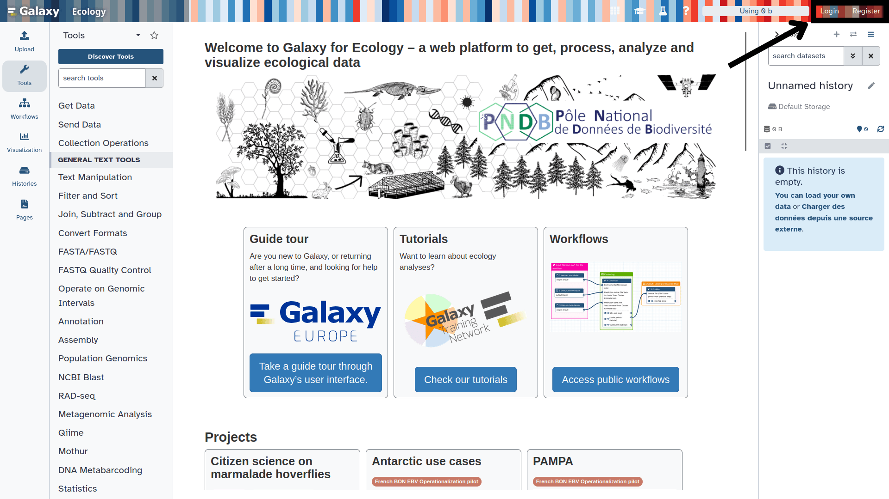
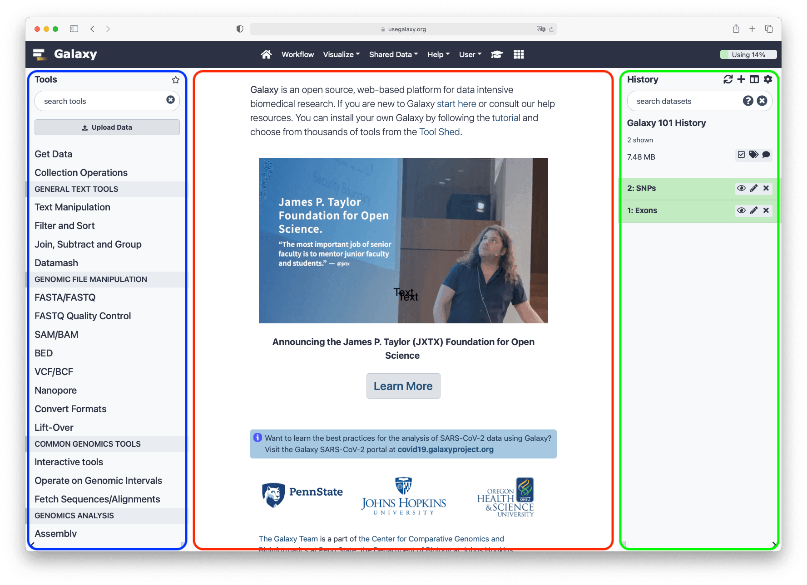
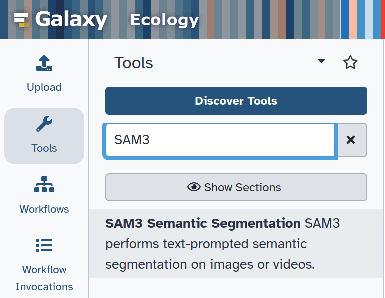
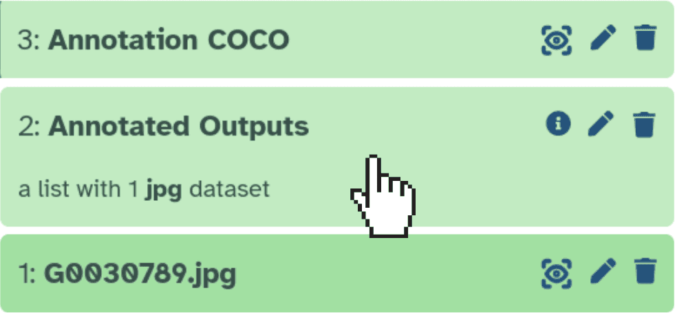
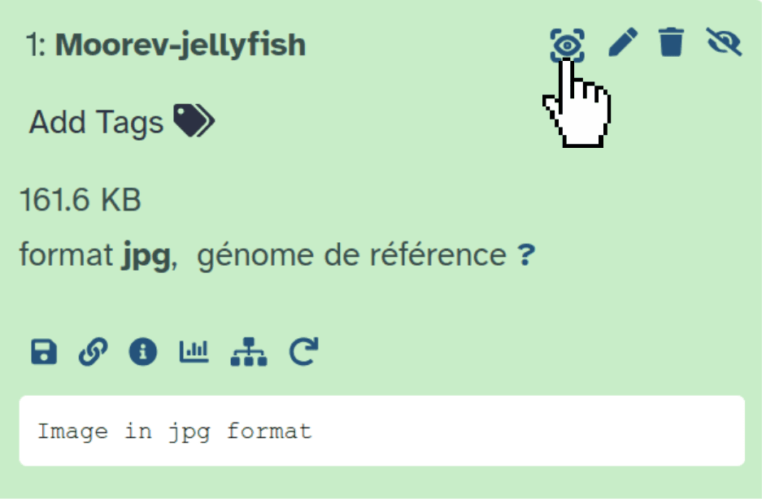
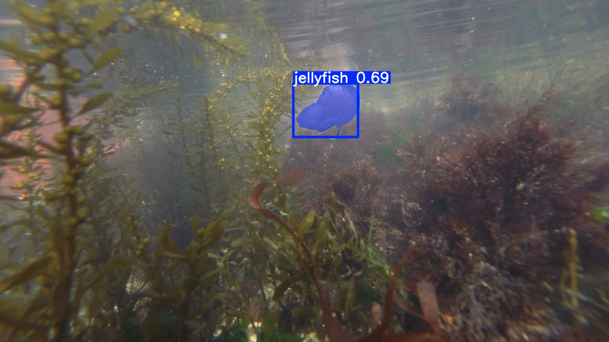
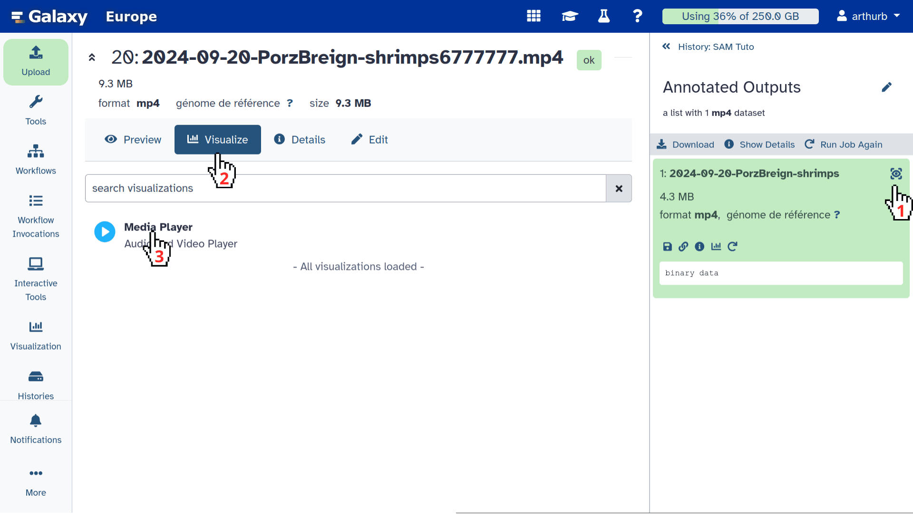
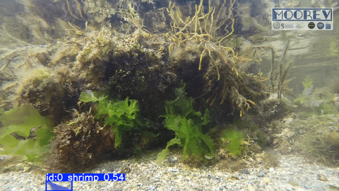

This tutorial will guide you through using the  (Segment Anything Model 3) tool on Galaxy. SAM3 can automatically detect and segment objects in images or videos using text prompts, with no specific training required.

We will work through two concrete examples from the Moorev project:
1. A **photograph of a jellyfish** (*Pelagia noctiluca*)
2. A **video of shrimps**

> <agenda-title>In this tutorial, we will cover:</agenda-title>
>
> 1. TOC
> {:toc}
>
{: .agenda}

> <details-title>Quick introduction to how Galaxy works</details-title>
>
> **Log in to Galaxy**
> 1. Open your preferred web browser 
> 2. Go to your Galaxy instance (please verify that the Galaxy instance you want to use propose SAM3 tool as Galaxy Europe is doing) 
> 3. Log in or create an account
>
> 
>
> This screenshot shows the Galaxy Ecology instance, available at [usegalaxy.eu](https://ecology.usegalaxy.eu/)
>
> The Galaxy home page is divided into 3 panels:
> * **Tools** on the left
> * The **visualisation panel** in the centre
> * The **history** of analyses and files on the right
>
> 
>
> The first time you use Galaxy, there will be no files in your history panel.
{: .details}

# Loading data into Galaxy

Before running SAM3 Galaxy tool, you need to import the following files into Galaxy:  
- The jellyfish photo: `https://zenodo.org/records/19890809/files/Moorev-jellyfish.jpg`
- The shrimp video: `https://zenodo.org/records/19891364/files/2024-09-20-PorzBreign-shrimps.mp4`



> <warning-title>File format not recognised?</warning-title>
>
> If you want to try with other files, make sure the file extension is correct before uploading, as Galaxy may not detect it automatically. In that case, two options:
> - During upload, specify the format using the **Type (set all)** field
> - From the history, click the  **pencil** icon, go to the **Datatype** tab and search for your extension
>
{: .warning}

# Segmenting an image: the jellyfish photograph

In this first section, we will run SAM3 Galaxy tool on the photo `Moorev-jellyfish.jpg` to detect and segment the jellyfish.  

> <tip-title>How to access the SAM3 tool?</tip-title>
>
> Type **SAM3** in the tool search bar at the top left, then click on the tool in the results.
>
> {: style="width:50%; display:block; margin:auto;"}
>
{: .tip}

## Configuring SAM3 for the image

> <hands-on-title>Segment the jellyfish in the photo</hands-on-title>
>
> 1.  with these parameters:
>
>    -  *"Model data"*: `Segment Anything Model 3 (SAM 3)` (default)
>    -  *"Input type"*: `One or more images` (default)
>    -  *"Input images"*: `Moorev-jellyfish.jpg`
>    -  *"Output formats"*: `COCO`
>    -  *"Text prompt"*: `jellyfish`
>    -  *"Confidence threshold"*: `0.5`
>    -  *"Video frame stride"*: `5` (default)
>    -  *"Show bounding boxes on annotated output"*: `Yes` (default)
>    -  *"Normalize outputs?"*: `No` (default)
>
>    > <tip-title>How to write a good prompt?</tip-title>
>    >
>    > The text prompt should describe the object to segment in **English**, using simple and precise terms.
>    > To detect multiple classes at once, separate them with commas:
>    > `jellyfish, shrimp, fish`
>    >
>    > Avoid overly vague descriptions like `animal` if you are specifically looking for a jellyfish.
>    > You can also use more descriptive prompt like `small blue fish`, but results may vary depending on the objects you want to detect.
>    {: .tip}
>
> 2. Click **Run Tool**
>
>    > <comment-title>Processing time</comment-title>
>    >
>    > Processing may take a few minutes depending on the image size and the resources available on the server. Wait until the outputs appear in green in the history.
>    >
>    {: .comment}
>
> 3. Once processing is complete, the following outputs appear in your history:
>    - **COCO Annotation**: the `annotations.json` file containing the segmentation masks
>    - **Annotated Outputs**: the collection of annotated images with overlaid masks
>
> 4. Viewing the annotated result
>
>    You should see the jellyfish outlined with a coloured mask and a bounding box.
>
>    > <tip-title>Display the image in the history</tip-title>
>    >
>    > Click on **Annotated Outputs** in the history panel:
>    > {: style="width:50%; display:block; margin:auto;"}
>    >
>    > Then use the  icon to display the image in the central panel:  
>    > {: style="width:50%; display:block; margin:auto;"}
>    >
>    > Or click  to download the file directly.
>    {: .tip}
>
>    {: style="width:75%; display:block; margin:auto;"}
>
> 5. Exploring the COCO file
>    - Look at the content of your **COCO Annotation** file in your history  
>    - Use  to view the JSON, or  to download it
>
>    The file contains the `images`, `annotations`, and `categories` fields. Each annotation includes:
>    - `segmentation`: the polygon coordinates of the mask
>    - `bbox`: the bounding box `[x, y, width, height]`
>    - `category_id`: the identifier of the detected class (`1` = `jellyfish`)
>
>    > <details-title>Export to YOLO format (optional)</details-title>
>    >
>    > If you need to train a YOLO model with your annotations, you can export results in YOLO format in addition to COCO.
>    > In the  *"Output formats"* parameter, select `COCO` **and/or** `YOLO segmentation masks` **and/or** `YOLO bounding boxes`.
>    >
>    > > <details-title>YOLO segmentation format</details-title>
>    > >
>    > > Each line in a YOLO segmentation label file follows this format:
>    > > ```
>    > > <class_id> <x1> <y1> <x2> <y2> ... <xn> <yn>
>    > > ```
>    > > Coordinates are normalised between 0 and 1 relative to the image dimensions.
>    > > Example for a jellyfish (class 0): `0 0.423 0.312 0.456 0.298 ...`
>    > >
>    > {: .details}
>    >
>    {: .details}
>
{: .hands_on}

# Segmenting a video: the shrimp video

In this second section, we will execute SAM3 tool to the video `2024-09-20-PorzBreign-shrimps.mp4`. SAM3 model analyses the video frame by frame, tracking the shrimps over time.  

## Configuring SAM3 for the video

> <hands-on-title>Segment the shrimps in the video</hands-on-title>
>
> 1.  with these parameters:
>    -  *"Model data"*: `Segment Anything Model 3 (SAM 3)` (default)
>    -  *"Input type"*: `One video`
>    -  *"Input video file"*: `2024-09-20-PorzBreign-shrimps.mp4`
>    -  *"Video quality"*: `"2000k" = video bitrate 2000 kbps (480p~720p)`
>    -  *"COCO output mode"*: `Annotate the video — one COCO entry per frame, referencing the video file` (default)
>    -  *"Text prompt"*: `shrimp`
>    -  *"Confidence threshold"*: `0.25` (default)
>    -  *"Video frame stride"*: `5` (default)
>    -  *"Show bounding boxes on annotated output"*: `Yes` (default)
>    -  *"Normalize outputs?"*: `No` (default)
>
>    > <tip-title>Understanding the video parameters</tip-title>
>    >
>    >  *"Video frame stride"*: determines how often frames are analysed. A stride of `5` means one frame in every five is processed.
>    > - **Low stride (1–3)**: more precise analysis, but longer processing time
>    > - **High stride (10–30)**: faster processing, useful for long videos where objects move slowly
>    >
>    >  *"Video quality"*: controls the quality of the annotated output video, with no impact on processing speed or annotations.
>    >
>    >  *"COCO output mode"*: controls how COCO annotations are generated.
>    > - `Annotate the video`: one COCO entry per frame, referencing the video file (default)
>    > - `Annotate extracted frames`: saves frames as JPGs with one COCO entry per image — useful for pre-processing, for example with the  tool as shown in the Moorev tutorial
>    >
>    {: .tip}
>
> 2. Click **Execute**
>
>    > <comment-title>Video processing time</comment-title>
>    >
>    > Video processing takes significantly longer than processing a single image. For a video of a few minutes, expect between 5 and 20 minutes depending on the server and the stride chosen.
>    >
>    {: .comment}
>
> 3. The following outputs appear in your history:
>    - **COCO Annotation**: the JSON file with annotations for each processed frame
>    - **Annotated Outputs**: the annotated video with segmentation masks overlaid frame by frame
>
> 4. Viewing the annotated video
>
>    - Click on **Annotated Outputs** in the history panel
>    - Click 
>    - Click 
>    - Select **Media Player**
>
>    > <tip-title>Display the video in Galaxy</tip-title>
>    >
>    > {: style="width:75%; display:block; margin:auto;"}
>    >
>    > > <warning-title>Video not loading?</warning-title>
>    > >
>    > > The video may not load in Galaxy for several reasons:
>    > > - The file is too large for your internet connection
>    > > - The  *"Video quality"*: `Original quality (copy)` setting makes in-browser playback unavailable
>    > >
>    > > In that case, use  to download the video and play it locally with your usual media player.  
>    > {: .warning}
>    >
>    {: .tip}
>
>    You will see the shrimps tracked with a coloured segmentation mask throughout the video.
>
>    {: style="width:50%; display:block; margin:auto;"}
>
> 5. Downloading the annotated video
>    - Click the **Annotated Outputs** collection
>    - Use  to download the `.mp4` video
>
>    > <comment-title>Limitations of SAM3 and pre-processing</comment-title>
>    >
>   > SAM3 tool is a first attempt to propose prompt-based  Galaxy tool. As it is using SAM3 model, you can have highly heterogenous results in term of quality depending on the objects you are searching to segment, notably if such kind of object can be on data used to train the SAM3 model. Adjusting the confidence threshold can help, but it does not solve everything. Pre-processing your images or videos is often necessary to improve results.  
>    > To learn more, check out the dedicated tutorial: **Tuto Moorev**
>    >
>    {: .comment}
>
{: .hands_on}

# Conclusion

You now know how to use SAM3 Galaxy tool to:
- Segment objects in an **image** using a simple text prompt
- Segment objects in a **video** frame by frame with temporal tracking
- Export results in **COCO** format (for annotation and evaluation tools) or **YOLO** format (for model training)
