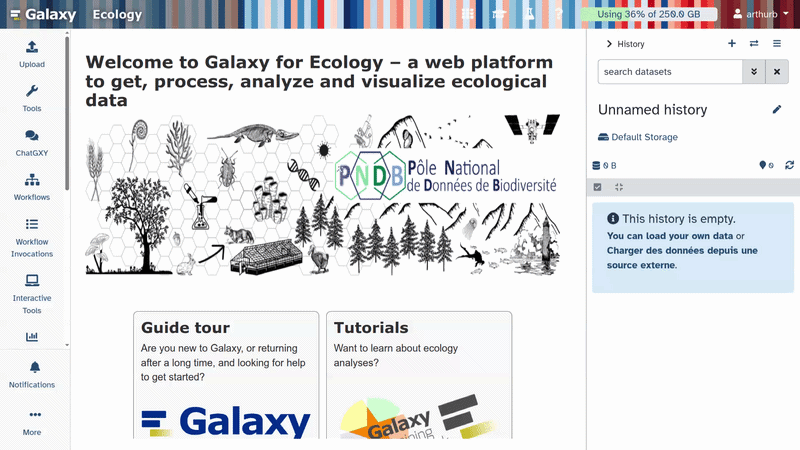

Ce tutoriel vous guidera dans l'utilisation de l'outil  (Segment Anything Model 3) sur Galaxy. SAM3 permet de détecter et segmenter automatiquement des objets dans des images ou des vidéos grâce à des prompts, sans nécessiter d'entraînement spécifique.

Nous allons travailler sur deux exemples concrets (liés au projet Moorev) :
1. Une **photographie d'une méduse** (*Pelagia noctiluca*)
2. Une **vidéo de crevettes**

> <agenda-title>Dans ce tutoriel, nous allons couvrir :</agenda-title>
>
> 1. TOC
> {:toc}
>
{: .agenda}

> <details-title>Rapide introduction sur le fonctionnement de Galaxy</details-title>
>
> **Se connecter à Galaxy**
> 1. Ouvrez votre navigateur internet préféré 
> 2. Rendez-vous sur votre instance Galaxy (Attention vérifier que l'instance Galaxy que vous utilisez propose l'outil SAM3, comme l'instance Galaxy Europe)
> 3. Connectez-vous ou créez un compte
>
> 
>
> Cette capture d'écran présente l'instance Galaxy Ecology, accessible à l'adresse [usegalaxy.eu](https://ecology.usegalaxy.eu/)
> 
> La page d'accueil de Galaxy est divisée en 3 parties :
> * Les **outils** sur la gauche
> * Le **panneau de visualisation** au centre
> * L'**historique** des analyses et des fichiers sur la droite
>
> 
>
> La première fois que vous utiliserez Galaxy, il n'y aura aucun fichier dans votre panneau d'historique.
{: .details}

# Charger les données dans Galaxy

Avant de lancer SAM3, vous devez importer les fichiers suivants dans Galaxy :
- La photo de méduse : `https://zenodo.org/records/19890809/files/Moorev-jellyfish.jpg`
- La vidéo de crevettes : `https://zenodo.org/records/19891364/files/2024-09-20-PorzBreign-shrimps.mp4`

> <tip-title>Téléverser les données dans Galaxy</tip-title>
>
> * Copiez le lien correspondant au fichier à importer
> * 1- Cliquez sur  **Upload** en haut du panneau d'activité
> * 2- Sélectionnez  **Paste/Fetch Data**
> * 3- Collez le lien dans le champ de texte `https://zenodo.org/records/19890809/files/Moorev-jellyfish.jpg`
> * 4- Cliquez sur **Start**
> * 5- Cliquez sur **Close** pour fermer la fenêtre
>
> {: style="width:80%; display:block; margin:auto;"}
>
{: .tip}

# Segmentation d'une image : la photo de méduse

Dans cette première partie, nous allons utiliser SAM3 sur la photo `Moorev-jellyfish.jpg` pour détecter et segmenter la méduse.

> <tip-title>Comment accéder à l'outil SAM3 ?</tip-title>
>
> Tapez **SAM3** dans la barre de recherche des outils en haut à gauche, puis cliquez sur l'outil dans les résultats.
>
> {: style="width:50%; display:block; margin:auto;"}
>
{: .tip}

## Paramétrage de SAM3 pour l'image

> <hands-on-title>Segmenter la méduse sur la photo</hands-on-title>
>
> 1.  avec ces paramètres :
>
>    -  *"Model data"* : `Segment Anything Model 3 (SAM 3)` (par défaut)
>    -  *"Input type"* : `One or more images` (par défaut)
>    -  *"Input images"* : `Moorev-jellyfish.jpg`
>    -  *"Output formats"* : `COCO`
>    -  *"Text prompt"* : `jellyfish`
>    -  *"Confidence threshold"* : `0.5`
>    -  *"Video frame stride"* : `5` (par défaut)
>    -  *"Show bounding boxes on annotated output"* : `Yes` (par défaut)
>    -  *"Normalize outputs?"* : `No` (par défaut)
>
>    > <tip-title>Comment rédiger un bon prompt ?</tip-title>
>    >
>    > Le prompt textuel doit décrire l'objet à segmenter en **anglais**, en termes simples et précis.
>    > Pour détecter plusieurs classes simultanément, séparez-les par des virgules :
>    > `jellyfish, shrimp, fish`
>    >
>    > Évitez les descriptions trop vagues comme `animal` si vous cherchez une méduse spécifiquement.
>    > Il est aussi possible de formuler des prompts plus descriptifs comme `small blue fish`, mais les résultats peuvent varier.
>    {: .tip}
>
> 2. Cliquez sur **Execute**
>
>    > <comment-title>Temps de traitement</comment-title>
>    >
>    > Le traitement peut prendre quelques minutes selon la taille de l'image et les ressources disponibles sur le serveur. Patientez jusqu'à ce que les sorties apparaissent en vert dans l'historique.
>    >
>    {: .comment}
>
> 3. Une fois le traitement terminé, les sorties suivantes apparaissent dans votre historique :
>    - **Annotation COCO** : le fichier `annotations.json` contenant les masques de segmentation
>    - **Annotated Outputs** : la collection d'images annotées avec les masques superposés
>
> 4. Visualisation du résultat annoté
>
>    Vous devriez voir la méduse entourée d'un masque coloré et d'une boîte englobante (bounding box).
>
>    > <tip-title>Afficher l'image dans l'historique</tip-title>
>    >
>    > Cliquez sur **Annotated Outputs** dans le panneau d'historique :
>    > {: style="width:50%; display:block; margin:auto;"}
>    >
>    > Puis cliquez sur l'icône  pour afficher l'image dans le panneau central :
>    > {: style="width:50%; display:block; margin:auto;"}
>    >
>    > Ou cliquez sur  pour télécharger le fichier directement.
>    {: .tip}
>
>    {: style="width:75%; display:block; margin:auto;"}
>
> 
> 5. Exploration du fichier COCO
>    - Cliquez sur **Annotation COCO** dans votre historique
>    - Cliquez sur  pour visualiser le JSON, ou sur  pour télécharger le fichier
>
>    Le fichier contient les champs `images`, `annotations` et `categories`. Chaque annotation comprend :
>    - `segmentation` : les coordonnées du contour polygonal du masque
>    - `bbox` : la boîte englobante `[x, y, width, height]`
>    - `category_id` : l'identifiant de la classe détectée (`1` = `jellyfish`)
>
>    > <details-title>Exporter au format YOLO (optionnel)</details-title>
>    >
>    > Si vous avez besoin d'entraîner un modèle YOLO avec vos annotations, vous pouvez exporter les résultats au format YOLO en plus du format COCO.
>    > Dans le paramètre  *"Output formats"*, sélectionnez `COCO` **et/ou** `YOLO segmentation masks` **et/ou** `YOLO bounding boxes`.
>    >
>    > > <details-title>Format YOLO segmentation</details-title>
>    > >
>    > > Chaque ligne d'un fichier label YOLO segmentation suit ce format :
>    > > ```
>    > > <class_id> <x1> <y1> <x2> <y2> ... <xn> <yn>
>    > > ```
>    > > Les coordonnées sont normalisées entre 0 et 1 par rapport aux dimensions de l'image.
>    > > Exemple pour une méduse (classe 0) : `0 0.423 0.312 0.456 0.298 ...`
>    > >
>    > {: .details}
>    >
>    {: .details}
>
{: .hands_on}


# Segmentation d'une vidéo : la vidéo de crevettes 

Dans cette seconde partie, nous allons appliquer SAM3 à la vidéo `2024-09-20-PorzBreign-shrimp.mp4`. SAM3 analyse la vidéo frame par frame en suivant les crevettes au fil du temps.

## Paramétrage de SAM3 pour la vidéo

> <hands-on-title>Segmenter les crevettes dans la vidéo</hands-on-title>
>
> 1.  avec ces paramètres :
>    -  *"Model data"* : `Segment Anything Model 3 (SAM 3)` (par défaut)
>    -  *"Input type"* : `One video`
>    -  *"Input video file"* : `2024-09-20-PorzBreign-shrimps.mp4`
>    -  *"Video quality"* : `"2000k" = video bitrate 2000 kbps (480p~720p)` (par défaut)
>    -  *"COCO output mode"* : `Annotate the video — one COCO entry per frame, referencing the video file` (par défaut)
>    -  *"Text prompt"* : `shrimp`
>    -  *"Confidence threshold"* : `0.25` (par défaut)
>    -  *"Video frame stride"* : `5` (par défaut)
>    -  *"Show bounding boxes on annotated output"* : `Yes` (par défaut)
>    -  *"Normalize outputs?"* : `No` (par défaut)
>
>    > <tip-title>Comprendre les paramètres vidéo</tip-title>
>    >
>    >  *"Video frame stride"* : détermine la fréquence d'analyse. Un stride de `5` signifie qu'une frame sur cinq est traitée.
>    > - **Stride faible (1–3)** : analyse plus précise, mais plus longue
>    > - **Stride élevé (10–30)** : traitement rapide, utile pour des vidéos longues où les objets bougent lentement
>    >
>    >  *"Video quality"* : contrôle la qualité de la vidéo annotée en sortie, sans impact sur la vitesse de traitement ni sur les annotations.
>    >
>    >  *"COCO output mode"* : contrôle la façon dont les annotations COCO sont générées.
>    > - `Annotate the video` : une entrée COCO par frame, référençant le fichier vidéo (par défaut)
>    > - `Annotate extracted frames` : sauvegarde les frames en JPG avec une entrée COCO par image. utile pour du pré-traitement, par exemple avec l'outil  comme dans le Tuto Moorev
>    >
>    {: .tip}
>
> 2. Cliquez sur **Execute**
>
>    > <comment-title>Temps de traitement vidéo</comment-title>
>    >
>    > Le traitement peut prendre quelques minutes selon la taille de la vidéo et les ressources disponibles sur le serveur. Patientez jusqu'à ce que les sorties apparaissent en vert dans l'historique.
>    >
>    {: .comment}
>
> 3. Les sorties suivantes apparaissent dans votre historique :
>    - **Annotation COCO** : le fichier JSON avec les annotations pour chaque frame traitée
>    - **Annotated Outputs** : la vidéo annotée avec les masques superposés frame par frame
>
> 4. Visualisation de la vidéo annotée
>
>    - Cliquez sur **Annotated Outputs** dans le panneau d'historique
>    - Cliquez sur 
>    - Cliquez sur 
>    - Sélectionnez **Media Player**
>
>    > <tip-title>Afficher la vidéo dans Galaxy</tip-title>
>    >
>    > {: style="width:75%; display:block; margin:auto;"}
>    >
>    > > <warning-title>La vidéo ne s'affiche pas ?</warning-title>
>    > >
>    > > Il est possible que la vidéo ne se charge pas dans Galaxy pour plusieurs raisons :
>    > > - La vidéo est trop volumineuse pour votre connexion internet
>    > > - Le paramètre  *"Video quality"* : `Original quality (copy)` rend l'affichage dans Galaxy indisponible
>    > >
>    > > Dans ce cas, utilisez  pour télécharger la vidéo et la lire localement avec votre lecteur vidéo habituel.
>    > {: .warning}
>    >
>    {: .tip}
> 
>    Vous verrez les crevettes suivies avec un masque de segmentation coloré tout au long de la vidéo.
>
>    {: style="width:50%; display:block; margin:auto;"}
>
> 5. Téléchargement de la vidéo annotée
>    - Cliquez sur la collection **Annotated Outputs**
>    - Cliquez sur  pour télécharger la vidéo `.mp4`
>
>    > <comment-title>Limites de SAM3 et pré-traitement</comment-title>
>    >
>    >L'outil SAM3 est une première tentative de proposer un outil Galaxy basé sur des prompts. Comme il utilise le modèle SAM3, les résultats peuvent être très hétérogènes en termes de qualité selon les objets que vous cherchez à segmenter, notamment si ce type d'objet était présent dans les données utilisées pour entraîner le modèle SAM3. Ajuster le seuil de confiance peut aider, mais cela ne résout pas tout. Un pré-traitement de vos images ou vidéos est souvent nécessaire pour améliorer les résultats.
>    > Pour en savoir plus, consultez le tutoriel dédié : **Tuto Moorev**
>    >
>    {: .comment}
>
{: .hands_on}


# Conclusion

Vous savez maintenant utiliser SAM3 sur Galaxy pour :
- Segmenter des objets dans une **image** à partir d'un simple prompt textuel
- Segmenter des objets dans une **vidéo** frame par frame avec suivi temporel
- Exporter les résultats au format **COCO** (pour les outils d'annotation et d'évaluation) ou **YOLO** (pour l'entraînement de modèles)
