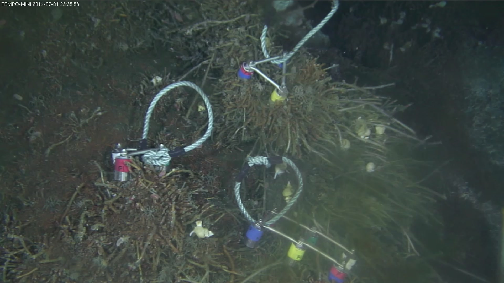
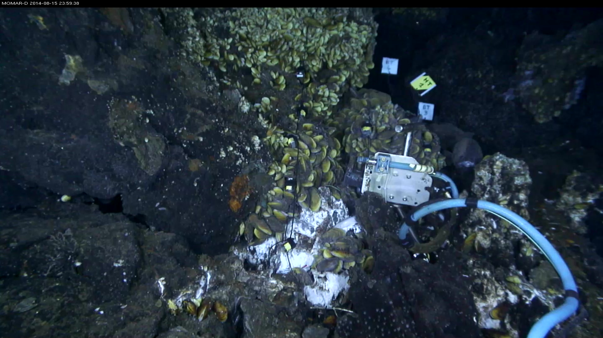
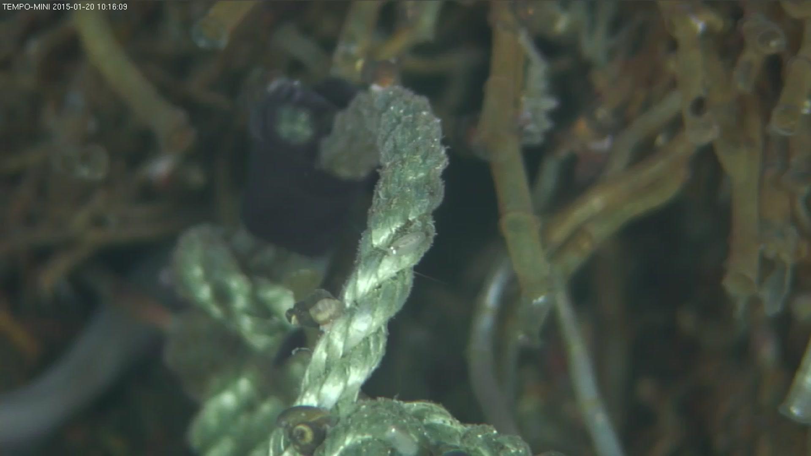
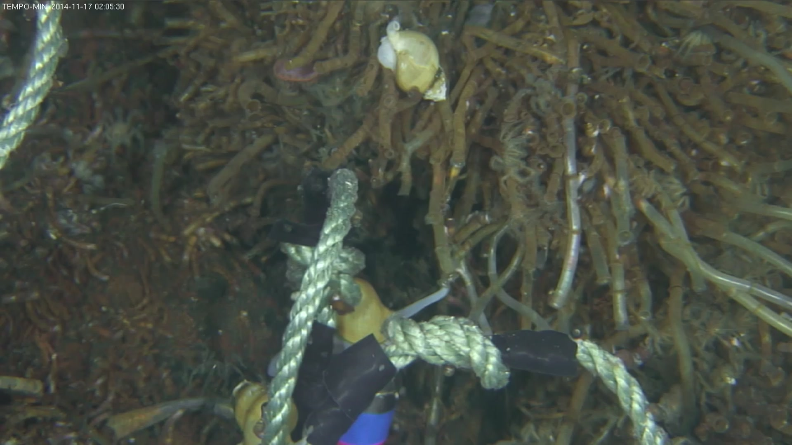
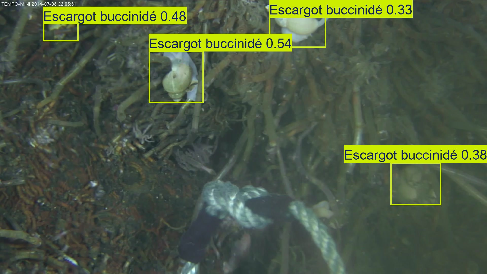
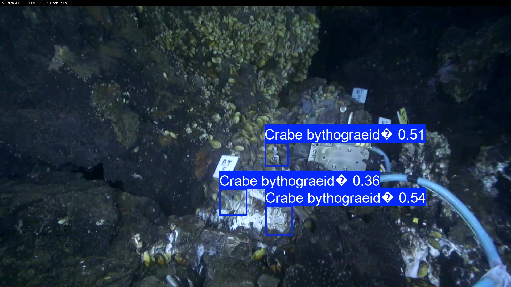

YOLO (You Only Look Once) is a fast, deep learning-based algorithm for real-time object detection. It predicts object classes and bounding boxes in a single pass over the image. YOLOv8 is a specific version, offering improved accuracy and speed.

In this tutorial, you will use Galaxy to run YOLOv8 model for **Object Detection** using real underwater images from the SEANOE dataset.

> <agenda-title></agenda-title>
>
> In this tutotial, we will cover:
>
> 1. TOC
> {:toc}
>
{: .agenda}


# Detection of marine species

## Input Dataset

We will use selected images from the SEANOE dataset .

The [SEANOE](https://www.seanoe.org/data/00907/101899) collection features real underwater images captured by deep‑sea observatories as part of a citizen science initiative called Deep Sea Spy. These non‑destructive imaging stations continuously monitor marine ecosystems and provide snapshots of various fauna. In this dataset, multiple annotators, including trained scientists and enthusiastic citizen scientists, have manually labeled images with polygons, lines, or points highlighting marine organisms. These annotations were then cleaned and converted into bounding boxes to create a training-ready dataset for object detection with YOLOv8. Though the exact species vary, images often include deep-sea fish, species, making this dataset well-suited for practicing detection tasks.

{: style="width:40%; display:inline-block;"}
{: style="width:40%; display:inline-block;"}
{: style="width:40%; display:inline-block;"}
{: style="width:40%; display:inline-block;"}


### Get data

> <hands-on-title> Data Upload </hands-on-title>
>
> 1. **Create a new history** for this tutorial
>    - Give it a name (example: “DeepSeaSpy Yolo tutorial”) for you to find it again later if needed.
>
>    
>
>    
>
> 2. **Import** image data files and models from [SEANOE marine datawarehouse](https://www.seanoe.org/data/00907/101899/).
>
>    DeepSeaSpy image data files and models as a zip file:
>    ```
>    https://www.seanoe.org/data/00907/101899/data/115473.zip
>    ```
>
>    
>
> 3.  with the following parameters:
>    - *"Input file"*: `115473.zip`
>
>    This will create a data collection in your history where all archive files will be unzipped.
>
> 4. **Unhide**  the models data files:
>    - In the history search bar, enter: `name:detection deleted:false visible:any`
>    - Then unhide  the 2 model files
>      - "dataset_seanoe_101899_YOLOv8-weights-for-Bythograeidae-detection" and
>      - "dataset_seanoe_101899_YOLOv8-weights-for-Buccinidae-detection".
>
>
>    
>
> 5. Select a sample of 100 image files and create a dedicated data collection
>    - History search `extension:jpg deleted:false visible:any` then
>    - click on "Select" and "Select All".
>    - click on "All 3979 selected" and "Build Dataset List" (or "Auto build list" depending on the selection mode),
>    - select 100 files and give a name of the data collection, "DeepSeaSpy 100 images sample" for example.
>
>    > <tip-title> Filter history to only show 100 files </tip-title>
>    > To select only last 100 files, you can use the history search function and specify `extension:jpg deleted:false hid>XXXX visible:any` in the search bar where XXXX is the id of the last image dataset minus 100.
>    > For example `extension:jpg deleted:false hid>3885 visible:any` if you have images until the history dataset ID 3985.
>    {: .tip}
>
> 6. **Create class name file** "Buccinide_classnames", copying and pasting this content in the file uploader:    ***Optional step - Only if using under "Galaxy Version 8.3.0+galaxy5" tool version***
>
>    ```
>    Autre poisson
>    Couverture de moules
>    Couverture microbienne
>    Couverture vers tubicole
>    Crabe araignée
>    Crabe bythograeidé
>    Crevette alvinocarididae
>    Escargot buccinidé
>    Ophiure
>    Poisson Cataetyx
>    Poisson chimère
>    Poisson zoarcidé
>    Pycnogonide
>    Ver polynoidé
>    Vers polynoidés
>    ```
>
>    
>
{: .hands_on}

## Model

This dataset provides two pretrained YOLOv8 detection models tailored for the marine species found in [SEANOE](https://www.seanoe.org/data/00907/101899). One model detects Buccinidae (a family of sea snails), and the other targets Bythograeidae (a family of deep-sea crabs). These models were trained on cleaned annotation sets that contain thousands of examples—for instance, the Buccinidae set includes over 14,900 annotations in total. For this tutorial, you’ll find two model files—`*.pt` files—each accompanied by the appropriate class_names.txt file. You can upload either or both to Galaxy to run detection experiments on your underwater images.

##  Run YOLOv8 in detect mode


> <hands-on-title> Detect Buccinid snails on images </hands-on-title>
>
> 1.  with the following parameters:
>    -  *"Input images"*: `DeepSeaSpy 100 images sample` (click the  button, then select "DeepSeaSpy 100 images sample" from the list)
>    -  *"YOLO class name file"*: `Buccinide_classnames` (input plain text file that lists the names of the classes the model can detect)
>    -  *"Model file"*: `dataset_seanoe_101899_YOLOv8-weights-for-Buccinidae-detection` (click the "…" button, then search for the name of the file or just filter with ".pt" statement)
>    - *"Prediction mode"*: `detect`
>    - *"Image size"*: `1000`
>    - *"Confidence"*: `0.25`
>    - *"IoU"*: `0.45`
>    - *"Max detections"*: `300`
>
>    > <warning-title> Models type </warning-title>
>    >
>    > The model is trained only for detection, not segmentation.
>    >
>    {: .warning}
>
> > <tip-title>IoU threshold parameter</tip-title>
> >
> >   Try changing the confidence and IoU thresholds (this is used for Non-Maximum Suppression (NMS), which removes overlapping detections) to see how detection results vary. It helps you find a good balance between sensitivity and accuracy.
> >
> >
> {: .tip}
>
> > <comment-title>Additional information on class names file and parameters</comment-title>
> >
> >    Concerning the class names file: Each class name must be on its own line, in the same order used during model training. So the class ID 0 corresponds to Buccinidae, and 1 to Bythograeidae.
> >    Concerning tool parameters:
> >    - *"Image size"*: Use 1000 (or a smaller number like 640 if processing speed is important). This controls how much the image is resized before prediction. Smaller values = faster but possibly less accurate.
> >    - *"Confidence"*: Set to 0.25 (25%). This controls how confident the model must be to report a detection. If you increase this value (e.g., 0.5), you’ll get fewer detections, but they’ll be more confident. If you lower it (e.g., 0.1), you may get more results, but possibly more false positives.
> >    - *"IoU"*: Set to 0.45. This is used for Non-Maximum Suppression (NMS), which removes overlapping detections. A higher IoU value (e.g., 0.7) keeps more overlapping boxes. A lower IoU (e.g., 0.3) removes more overlaps, which may help clean up crowded images.
> >    - *"Max detections"*: Set a reasonable cap like 300. This limits the number of objects detected per image.
> >
> {: .comment}
>
{: .hands_on}

##  Explore the Outputs

After running the tool, Galaxy will give you several output files for each image. Let’s go through what each one means and how to use them:

### Text files (*.txt)

These are plain text files containing the detection results. Each line in a file shows:

```
<class_id> <confidence_score> <x_center> <y_center> <width> <height>
```

For example: ```0 0.82 350 200 100 120```

> <question-title></question-title>
>
> 1. What is the meaning of these lines ?
>
> > <solution-title></solution-title>
> >
> > 1. Class ID 0 (in our case, Buccinidae)
> > 2. Detected with 82% confidence
> > 3. The bounding box is centered at (350, 200) and has a width of 100 and height of 120 (in pixels, relative to the image. You can use this file to do further analysis, like counting species or tracking locations over time
> >
> {: .solution}
>
{: .question}

### Overlay images (*.jpg)

These are your original images with colored boxes drawn around detected species. Each box also includes:
The class name and the confidence score. For example, you might see a box labeled:
`Esxcargot buccinidé 0.40`



And if you reexecute the Yolo labeling tool specifying the "dataset_seanoe_101899_YOLOv8-weights-for-Bythograeidae-detection" model file, you will obtain detection result for crabs.



These images are useful for visually checking whether detections are correct or if something was missed.

> <comment-title> What's the `?` in the labels ?</comment-title>
> The `?` character you see in the annotation is due to an incompatibility between the class names in the pre-trained model and the character encoding used on the system where the model was originally trained. This typically happens when non-UTF-8 characters are not properly handled during training or export.
{: .comment}

### No masks or segmentation files
Since we used detect mode, this tool will not generate segmentation masks (like .tiff or polygon files). Those are only available in segment mode, which we'll cover in a separate tutorial.


## What to Look For

- Are species detected correctly?
- Any false positives or missed detections?
- What confidence levels do you observe?
- How many objects per image?


# Next Steps

Want to go further?

- Train your own model on SEANOE annotations using 
- Get more information from [YOLOv8 training notebook](https://docs.ultralytics.com)


