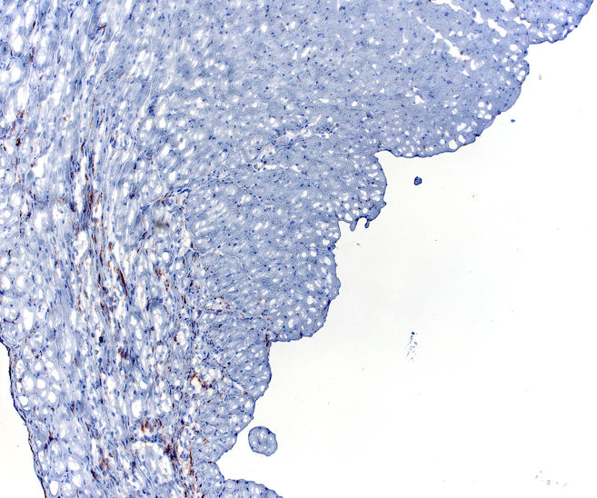
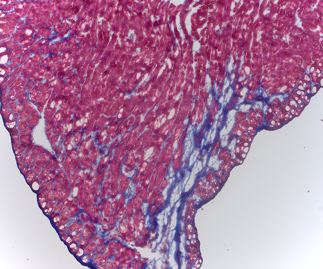
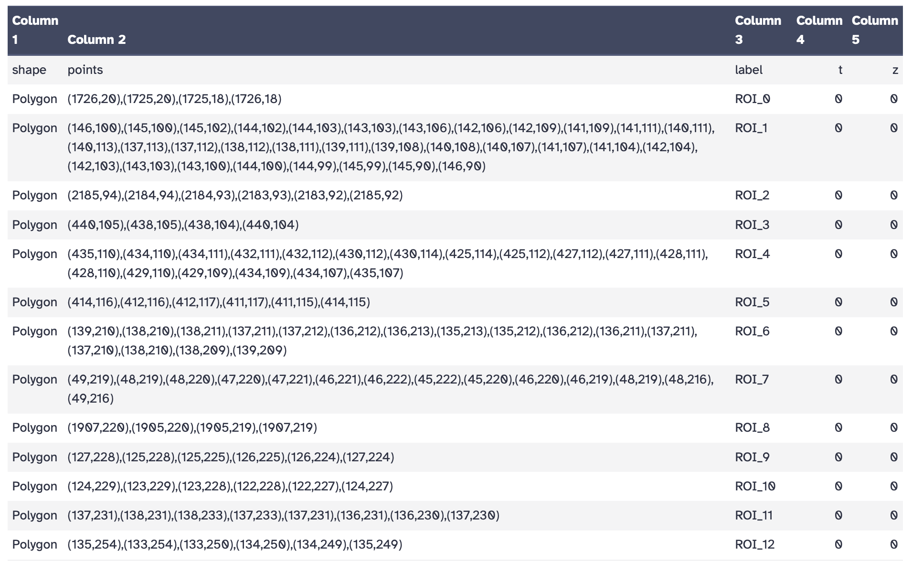
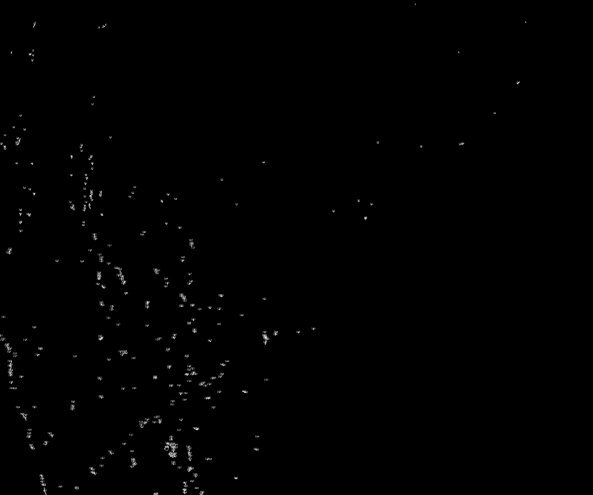
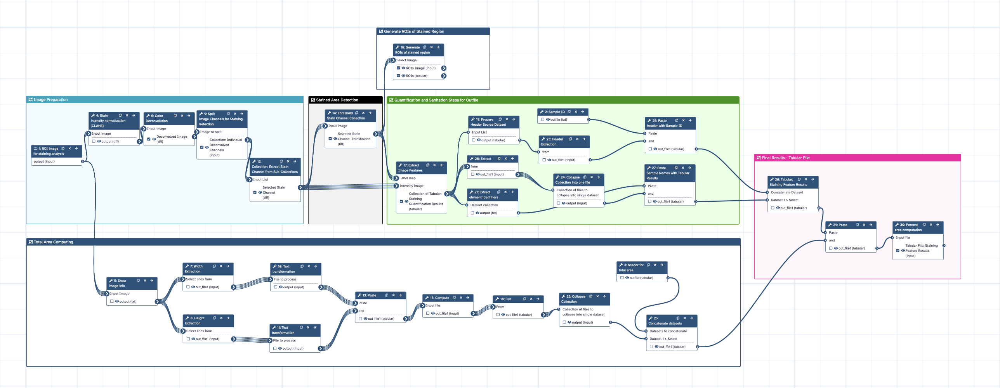

Manually scoring histological staining across dozens of images is time-consuming and subjective. Two researchers looking at the same slide may reach different conclusions about how much staining is present. Computational automatize quantification solves this problem: it applies the same criteria to every image, produces a numeric result, and scales to large datasets without additional effort.

This tutorial walks you through a Galaxy workflow that quantifies stained area in brightfield histological images, from raw microscopy image to a final table of percentages ready for statistical analysis. The workflow also includes an optional step that detects individual stained regions and exports them as polygon ROIs, which can be uploaded to image management platforms like [OMERO](https://www.openmicroscopy.org/omero/) for visual validation, annotation, and collaborative review.

The approach is built around color deconvolution, a technique that mathematically separates overlapping stain signals so you can measure each one independently.

In this tutorial you will work with **IHC (Immunohistochemistry)**, detecting CD11b-positive myeloid cells using a DAB chromogen.

> <comment-title>Workflow applicability</comment-title>
>
> This tutorial uses IHC (CD11b/DAB) images as the working example. The same workflow applies directly to **Masson's Trichrome (MT)** staining for collagen quantification.The only difference is selecting channel index that correspondes to the aniline blue instead DAB in Step 2. MT support will be added as an extended version of this tutorial in the future.
>
{: .comment}

> <agenda-title></agenda-title>
>
> In this tutorial, we will cover:
>
> 1. TOC
> {:toc}
>
{: .agenda}

# Background: What Is Color Deconvolution and Why Do We Need It?

When two stains are applied to the same tissue section, for example, hematoxylin (blue) and DAB (brown) in IHC, their colors overlap in the RGB image. This means that one cannot simply threshold on "brownness" or "blueness" because the RGB channels mix all stain signals together.

**Color deconvolution** solves this by using a **stain matrix**: a set of vectors that describe how much each stain absorbs light in the red, green, and blue channels. The algorithm inverts this matrix to compute the optical density of each stain independently at every pixel, producing one grayscale image per stain component. Higher pixel values in the output correspond to stronger staining.

In this tutorial, we use the **H-E-DAB (HED)** preset:

| Channel | Index | IHC interpretation |
|---|---|---|
| Channel 1 | 0 | Hematoxylin (nuclei, counterstain) |
| Channel 2 | 1 | **DAB — stain of interest** |
| Channel 3 | 2 | Residual |

> <details-title>What is a stain vector?</details-title>
>
> A stain vector describes how much a given stain absorbs light in each of the three RGB color channels. For example, DAB absorbs strongly in the blue channel and weakly in the red channel, while hematoxylin absorbs more in the red and green channels. These values are determined empirically from pure stain reference images or taken from published standards. The color deconvolution algorithm uses these vectors to solve a system of linear equations and separate the mixed stain signals pixel by pixel.
>
{: .details}

> <details-title>When to consider Non-negative Matrix Factorization (NMF) instead</details-title>
>
> For most standard IHC images with a clean DAB + hematoxylin combination, the HED preset is sufficient. However, when staining is uneven, the signal is weak, or there is significant spectral overlap, a data-driven approach may give better results.
>
> **Non-negative Matrix Factorization (NMF)** learns the stain components directly from the image data, without relying on predefined stain vectors. This makes it more flexible when staining deviates from standard reference spectra, for example, due to differences in staining protocols, tissue processing, or scanner calibration. To use NMF, select `Non-negative matrix factorization` as the transformation type. Since NMF components are not labeled by stain name, you will need to visually inspect the output channels to identify which one corresponds to your stain of interest.
>
{: .details}

# The Dataset: Cardiac Tissue After Myocardial Infarction

The images in this tutorial come from a study () investigating the role of 4-oxo retinoic acid (4-oxo RA) in maintaining hematopoietic stem cell dormancy after myocardial infarction (MI). Understanding this biological context helps interpret what the numbers mean.

**The experimental model:** Mouse hearts were subjected to LAD coronary artery ligation to induce MI. Animals were treated with 4-oxo RA or with the vehicle solution (DSMO) after MI. Serial cardiac sections were stained to assess the post-infarction immune response.

**IHC for CD11b** detects myeloid leukocytes (monocytes, macrophages, neutrophils), a readout of local inflammation. Higher CD11b-positive area = more immune cell infiltration after MI.

The hypothesis in the study is that 4-oxo RA reduces immune cell mobilization from bone marrow, leading to less inflammatory infiltration (reduced presence of CD11b+ cells positive stained regions) that would lead to less fibrosis and prevent adverse cardiac remodeling concluding on preserved cardiac function.

**What you are working with:** In the original study, regions of interest (ROIs) were manually selected from whole-slide images to focus on specific anatomical zones (Infarct, Border, Remote) and exclude tissue artifacts. For this tutorial, we will keep it simple and focus on analyzing the whole-slide image and process the data as a list of collection allowing you to focus entirely in understanding the analysis and quantification workflow.

Here is an example of what the raw input images look like:





> <comment-title>Sample data vs. full dataset</comment-title>
>
> The images provided here are a representative subset of the full dataset from . In practice, workflows like this one are run across large image batches spanning multiple experiments, animals, conditions, and anatomical zones. The workflow you will run here is similar to what was applied at scale in the original study. The Masson's Trichrome image is shown for reference. MT quantification follows the same workflow and will be covered in a future version of this tutorial.
>
{: .comment}

## Data Upload

> <hands-on-title>Upload your images</hands-on-title>
>
> 1. Create a new history and name it something meaningful, e.g. `Histology Stain Quantification`
> 2. Import the images from [Zenodo]({{ page.zenodo_link }}) or from the shared data library (`GTN - Material` → `{{ page.topic_name }}` → `{{ page.title }}`):
>    - `Tx` (treated)
>    - `Vehicle` (DMSO or untreated)
>
>    ```text
>    {{ page.zenodo_link }}/files/Tx_Sample1.tiff
>    {{ page.zenodo_link }}/files/Tx_Sample2.tiff
>    {{ page.zenodo_link }}/files/Tx_Sample3.tiff
>    {{ page.zenodo_link }}/files/Tx_Sample4.tiff
>    {{ page.zenodo_link }}/files/Tx_Sample5.tiff
>    {{ page.zenodo_link }}/files/Tx_Sample6.tiff
>    {{ page.zenodo_link }}/files/Tx_Sample7.tiff
>    {{ page.zenodo_link }}/files/Tx_Sample8.tiff
>    {{ page.zenodo_link }}/files/Tx_Sample9.tiff
>    {{ page.zenodo_link }}/files/Tx_Sample10.tiff
>    {{ page.zenodo_link }}/files/Vehicle_Sample1.tiff
>    {{ page.zenodo_link }}/files/Vehicle_Sample2.tiff
>    {{ page.zenodo_link }}/files/Vehicle_Sample3.tiff
>    {{ page.zenodo_link }}/files/Vehicle_Sample4.tiff
>    {{ page.zenodo_link }}/files/Vehicle_Sample5.tiff
>    {{ page.zenodo_link }}/files/Vehicle_Sample6.tiff
>    {{ page.zenodo_link }}/files/Vehicle_Sample7.tiff
>    {{ page.zenodo_link }}/files/Vehicle_Sample8.tiff
>    {{ page.zenodo_link }}/files/Vehicle_Sample9.tiff
>    {{ page.zenodo_link }}/files/Vehicle_Sample10.tiff
>    ```
>
>    
>
>    
>
> 3. Rename the datasets with descriptive names if needed (e.g. `IHC_TXsample1.tiff` or `IHC_Vehiclesample1.tiff`). In total, there should be 20 tiff images, 10 for each group.
> 4. Check that the datatype is `tiff`
>
>    
>
> 5. Organize your images into a **dataset collection**. Collections allow the workflow to process all images in a single run.
>
>    
>
> > <comment-title>Image requirements</comment-title>
> >
> > Images must be brightfield RGB microscopy images in TIFF format. Fluorescence images are not compatible with color deconvolution. Avoid images with strong artifacts, out-of-focus regions, or uneven illumination, as these reduce quantification accuracy. Therefore, it is strongly recommended that you insepct your images one-by-one before proceeding to the pre-processing steps. 
> >
> {: .comment}
>
{: .hands_on}

The workflow associated with this tutorial requires a dataset collection as input. The steps described below are explained individually for clarity, but in Galaxy all images are processed together in a single batch run. For this reason, make sure your images are named descriptively before building the collection — the final results table will use those names to identify each sample.



# Step 1 — Normalization

Variations in staining intensity across images due to differences in staining batches, slide preparation, or scanner settings, can affect the consistency of downstream quantification. To reduce this variability, we apply histogram equalization as a preprocessing step before color deconvolution.

We use **CLAHE (Contrast Limited Adaptive Histogram Equalization)**, which enhances local contrast without amplifying noise, making stain signals more consistent across the image batch.

> <comment-title>About stain normalization</comment-title>
>
> More advanced stain normalization methods such as Macenko or Reinhard normalization can standardize color appearance across slides by transferring the stain profile of a reference image to all others. These methods are not currently available as Galaxy tools, but we are working on adding them. If you have access to them in the meantime (e.g. via Python or QuPath), applying them before this workflow may further improve consistency across batches.
>
{: .comment}

> <hands-on-title>Apply histogram equalization</hands-on-title>
>
> 1.  with the following parameters:
>    -  *"Input image"*: your image collection
>    - *"Histogram equalization algorithm"*: `CLAHE`
>
{: .hands_on}

Your normalized output should look similar to this example. Notice how the contrast is more balanced compared to the raw input, with stain signals appearing more uniform 
across the tissue:


# Step 2 — Color Deconvolution

This step separates the mixed stain signals in your brightfield image into individual channels. We use the H-E-DAB (HED) color space for this dataset. Note that the staining in these images does not follow a typical H-DAB pattern, using the H-DAB option would yield inaccurate results. If your own images present standard H-DAB coloring, you can use the H-DAB deconvolution option instead.

> <hands-on-title>Run color deconvolution</hands-on-title>
>
> 1.  with the following parameters:
>    -  *"Input image"*: your image collection
>    - *"Transformation type"*: `Deconvolve RGB into Hematoxylin + Eosin + DAB`
>
>    > <comment-title>Output</comment-title>
>    >
>    > Each input image produces one multi-channel TIFF. Each channel is a grayscale image where brighter pixels indicate higher optical density (stronger staining) for that component. You will extract the relevant channel in the next step.
>    >
>    {: .comment}
>
{: .hands_on}

The figure below shows what to expect after deconvolution for an IHC image. The DAB channel (right) clearly isolates the brown signal from the blue hematoxylin counterstain:

.")

# Step 3 — Split Channels and Extract the Stain of Interest

The deconvolution output is a multi-channel TIFF containing one channel per stain component. You need to split it into individual single-channel images and then select the one that corresponds to your stain of interest.

> <hands-on-title>Split the multi-channel image</hands-on-title>
>
> 1.  with the following parameters:
>    -  *"Image to split"*: output of **Perform color deconvolution or transformation** 
>
{: .hands_on}

This produces a collection of three single-channel grayscale images — one per stain component. Now extract the DAB channel:

> <hands-on-title>Extract the DAB channel (IHC)</hands-on-title>
>
> 1.  with the following parameters:
>    -  *"Input List"*: output of **Split image along axes** 
>    - *"How should a dataset be selected?"*: `Select by index`
>    - *"Element index"*: `1`
>
>    > <comment-title>Why index 1?</comment-title>
>    >
>    > The split collection is zero-indexed. In the HED preset, Channel 2 (DAB) corresponds to index `1`.
>    >
>    {: .comment}
>
{: .hands_on}

 after color deconvolution and split.")

> <question-title></question-title>
>
> 1. What does a high pixel intensity value mean in the deconvolved DAB channel?
> 2. What index would you use to extract the hematoxylin channel from an HED deconvolution?
>
> > <solution-title></solution-title>
> >
> > 1. Higher pixel values in the deconvolved channel represent stronger staining (higher optical density of that dye at that location). Darker brown regions in the original IHC image become bright pixels in the DAB channel.
> > 2. Hematoxylin is Channel 1, so you would use index `0`.
> >
> {: .solution}
>
{: .question}

# Step 4 — Capture Total Image Area

To calculate the percentage of stained area, you need two numbers: how many pixels are stained, and how many pixels make up the whole tissue image. The stained pixels will be measured later from the thresholded image. The workflow performs this step automatically, but here we will go through it together to understand what information is being extracted and why image dimensions matter for computing the total area.

> <hands-on-title>Get image dimensions from the original image</hands-on-title>
>
> 1.  with the following parameters:
>    -  *"Input Image"*: your original image collection (the same collection you provided as input to color deconvolution)
>
>    > <comment-title>Why use the original image here?</comment-title>
>    >
>    > We extract dimensions from the raw input image (not the deconvolved output) because the original image faithfully represents the full tissue area captured by the microscope. This ensures the total area denominator is correct regardless of any processing applied downstream.
>    >
>    {: .comment}
>
> 2.  to extract the image width:
>    -  *"Select lines from"*: output of **Show image info** 
>    - *"the pattern"*: `Width =`
>
> 3.  to extract the image height:
>    -  *"Select lines from"*: output of **Show image info** 
>    - *"the pattern"*: `Height =`
>
> 4.  to isolate the width value:
>    -  *"File to process"*: output of **Select** (Width) 
>    - *"SED Program"*: `s/.*= //`
>
>    > <comment-title>What does this expression do?</comment-title>
>    >
>    > The image info tool returns lines like `Width = 1024`. The sed expression `s/.*= //` strips everything up to and including `= `, leaving just the number. This is necessary so it can be used in arithmetic downstream.
>    >
>    {: .comment}
>
> 5.  to isolate the height value:
>    -  *"File to process"*: output of **Select** (Height) 
>    - *"SED Program"*: `s/.*= //`
>
> 6.  to combine width and height side by side:
>    -  *"Paste"*: output of **Text transformation** (width) 
>    -  *"and"*: output of **Text transformation** (height) 
>
> 7.  to calculate total pixel area (width × height):
>    -  *"Input file"*: output of **Paste** 
>    - *"Input has a header line with column names?"*: `No`
>    - In *"Expressions"* → *"Insert Expressions"*:
>      - *"Add expression"*: `c1 * c2`
>    - *"If an expression cannot be computed for a row"*: `Fail the entire tool run`
>
{: .hands_on}

> <question-title></question-title>
>
> An image is 1024 × 768 pixels. What is the total pixel area, and why does it matter?
>
> > <solution-title></solution-title>
> >
> > Total pixel area = 1024 × 768 = 786,432 pixels. This is the denominator in the percentage formula: (stained pixels / total pixels) × 100. Without it you can count stained pixels in absolute terms but cannot compare meaningfully across images of different sizes.
> >
> {: .solution}
>
{: .question}

# Step 5 — Threshold the Stain Channel

Now you will convert the extracted grayscale channel into a binary mask: pixels are classified as either stained (value = 1) or unstained (value = 0). This is the foundation for measuring stained area, and a very important step. 

> <hands-on-title>Apply Otsu thresholding</hands-on-title>
>
> 1.  with the following parameters:
>    -  *"Input image"*: output of **Extract dataset**  (your extracted stain channel)
>    - *"Thresholding method"*: `Globally adaptive / Otsu`
>
{: .hands_on}

Otsu's method automatically finds the threshold that best separates the two pixel populations (stained and unstained) by minimizing the variance within each group. Because it adapts to each image's intensity distribution, you do not need to set a manual value per image, making the results more consistent across a large batch. Other thresholding methods are also available in the tool, so feel free to select the one that best fits your images. Additionally, if you would like to restrict the threshold for positive pixel detection, you can adjust the offset value slightly. A value between 0.0 and 0.01 is a good starting point.

.")


# Step 6 — Generate ROIs for Visual Validation

Before moving to quantification, it is good practice to visually verify that the thresholded mask captures what you expect. This step detects stained regions in the binary mask and generates polygon ROIs around them. In IHC images like ours, the CD11b-positive cells are small and scattered across the tissue, so the resulting ROIs appear as small point-like outlines that can be difficult to spot in the Galaxy image viewer at full scale. Zooming in on the outline image will help you inspect them more clearly. For a richer validation experience, the ROI files can be uploaded to OMERO and overlaid directly on the original images. At full scale (left), the yellow outlines mark the overall distribution of detected DAB-positive regions. Zooming in (right) makes individual ROIs much easier to identify, as shown below.


> <hands-on-title>Detect stained regions and generate ROIs</hands-on-title>
>
> 1.  with the following parameters:
>    -  *"Select image"*: output of **Threshold image** 
>    - *"Black background"*: `Yes`
>    - *"Size (pixel^2)"*: `2-Infinity`
>    - *"Show"*: `Outlines`
>    - *"Export particles outlines coordinates"*: `Yes`
>
>    > <comment-title>What does the size filter do?</comment-title>
>    >
>    > Setting a minimum particle size of 2 pixels excludes very small specks that are likely noise or staining artifacts rather than real signal. Adjust this value depending on the scale and resolution of your images.
>    >
>    {: .comment}
>
{: .hands_on}

This produces two outputs per image: an outline image showing detected particles, and a tabular file with ROI coordinates. The table lists each detected region as a polygon with its corresponding pixel coordinates, label, and timepoint/z-slice index, as shown below.



Use the outline image to quickly check whether the detected regions match the staining you see in the original image before proceeding to quantification.



> <tip-title>Uploading ROIs to OMERO for validation</tip-title>
>
> If your facility uses OMERO for image management, the ROI files generated here can be uploaded alongside the original whole-slide images to overlay and visually validate your threshold results at scale. For a full walkthrough of how to work with OMERO in Galaxy, see the [Overview of the Galaxy OMERO-suite tutorial]().
>
{: .tip}

# Step 7 — Extract Quantitative Features

With a validated binary mask, you can now measure the stained area. The feature extraction tool measures properties of the labeled regions in the mask, using the grayscale stain channel for intensity information.

> <hands-on-title>Measure stained pixel area and intensity</hands-on-title>
>
> 1.  with the following parameters:
>    -  *"Label map"*: output of **Threshold image** 
>    - *"Features to compute"*: `Use the intensity image to compute additional features`
>      -  *"Intensity image"*: output of **Extract dataset** 
>      - *"Available features"*: `Label from the label map`, `Area`, `Filled area`, `Mean intensity`
>
>    > <comment-title>What do these features mean?</comment-title>
>    >
>    > - **Label from the label map** — the pixel class (1 = stained region)
>    > - **Area** — the number of stained pixels (this is what you will use for the percentage)
>    > - **Filled area** — area including any internal holes in the stained region
>    > - **Mean intensity** — average pixel intensity within the stained region, which can complement the area measurement as a proxy for staining strength
>    >
>    > Additional features such as perimeter, centroid, or eccentricity are also available and can be selected depending on your analysis needs.
>    >
>    {: .comment}
>
{: .hands_on}

# Step 8 — Compile Results and Calculate Percent Stained Area

You now have, for each image: the stained pixel area (from feature extraction) and the total pixel area (from image dimensions). This final section merges all per-sample results into a single table and calculates the percentage.

## Merge the Feature Results

> <hands-on-title>Collapse per-image results into one table</hands-on-title>
>
> 1.  to get the first dataset from the feature collection (used to extract the header row):
>    -  *"Input List"*: output of **Extract image features** 
>    - *"How should a dataset be selected?"*: `The first dataset`
>
> 2.  to isolate the header row:
>    - *"Select first"*: `1`
>    -  *"from"*: output of **Extract dataset** 
>
> 3.  to extract the data row from each image's feature file:
>    - *"Select last"*: `1`
>    -  *"from"*: output of **Extract image features** 
>
> 4.  to get sample file names:
>    -  *"Dataset collection"*: output of **Extract image features** 
>
> 5.  to merge all data rows into one file:
>    -  *"Collection of files to collapse"*: output of **Select last** 
>
> 6.  to create a `sample_id` column header:
>    - *"Line"*: `sample_id`
>
> 7.  to combine the sample_id header with the feature header:
>    -  *"Paste"*: output of **Create text file** (sample_id) 
>    -  *"and"*: output of **Select first** (feature header) 
>
> 8.  to combine sample names with their corresponding data rows:
>    -  *"Paste"*: output of **Extract element identifiers** 
>    -  *"and"*: output of **Collapse Collection** 
>
> 9.  to build the full table with header:
>    -  *"Concatenate Dataset"*: output of **Paste** (header row) 
>    - In *"Dataset"* → *"Insert Dataset"*:
>      -  *"Select"*: output of **Paste** (data rows) 
>
{: .hands_on}

## Add the Total Area Column

> <hands-on-title>Merge the total area values</hands-on-title>
>
> 1.  to extract the total area column (column 3) from the computed area file:
>    - *"Cut columns"*: `c3`
>    -  *"From"*: output of **Compute** (width × height) 
>
> 2.  to merge the total area values across samples:
>    -  *"Collection of files to collapse"*: output of **Cut** 
>
> 3.  to create a `total_area` column header.
>    - *"Line"*: `total_area`
>
> 4.  to prepend the header to the total area values:
>    -  *"Datasets to concatenate"*: output of **Create text file** (total_area) 
>    - In *"Dataset"* → *"Insert Dataset"*:
>      -  *"Select"*: output of **Collapse Collection** (total area) 
>
> 5.  to join the feature results table with the total area column:
>    -  *"Paste"*: output of **Concatenate multiple datasets or collections** 
>    -  *"and"*: output of **Concatenate datasets** 
>
{: .hands_on}

## Calculate Percent Stained Area

You now have a single table with all the values you need. The final step divides stained area by total area and multiplies by 100.

> <hands-on-title>Compute percent stained area</hands-on-title>
>
> 1.  with the following parameters:
>    -  *"Input file"*: output of **Paste** (full table) 
>    - *"Input has a header line with column names?"*: `Yes`
>    - In *"Expressions"* → *"Insert Expressions"*:
>      - *"Add expression"*: `c4 / c6 * 100`
>      - *"The new column name"*: `percent_area`
>    - *"If an expression cannot be computed for a row"*: `Fail the entire tool run`
>
>    > <comment-title>Understanding the formula</comment-title>
>    >
>    > `c4` = stained pixel area (from feature extraction); `c6` = total pixel area (width × height). Dividing and multiplying by 100 expresses the result as a percentage. If your column order differs, verify the column numbers by inspecting the merged table before running this step.
>    >
>    {: .comment}
>
{: .hands_on}

Your final output is a TSV table with one row per sample, containing: `sample_id`, `label`, `area`, `area_filled`, `mean_intensity`, `total_area`, and `percent_area`. This file is ready for downstream statistical analysis:

| sample_id | label | mean_intensity | area | area_filled | total_area | percent_area |
|---|---|---|---|---|---|---|
| Tx_Sample1 | 255 | 0.682 | 3653.0 | 3686.0 | 5065984 | 0.072 |
| Tx_Sample2 | 255 | 0.734 | 6574.0 | 6593.0 | 5065984 | 0.130 |
| Tx_Sample3 | 255 | 0.768 | 1396.0 | 1398.0 | 5065984 | 0.028 |
| Tx_Sample4 | 255 | 0.688 | 7184.0 | 7228.0 | 5065984 | 0.142 |
| Tx_Sample5 | 255 | 0.678 | 18245.0 | 18371.0 | 5065984 | 0.360 |
| Tx_Sample6 | 255 | 0.610 | 31943.0 | 32352.0 | 5065984 | 0.631 |
| Tx_Sample7 | 255 | 0.639 | 34089.0 | 34435.0 | 5065984 | 0.673 |
| Tx_Sample8 | 255 | 0.755 | 5271.0 | 5282.0 | 5065984 | 0.104 |
| Tx_Sample9 | 255 | 0.763 | 2350.0 | 2356.0 | 5065984 | 0.046 |
| Tx_Sample10 | 255 | 0.763 | 2099.0 | 2100.0 | 5065984 | 0.041 |
| Vehicle_Sample1 | 255 | 0.637 | 55764.0 | 58010.0 | 5065984 | 1.101 |
| Vehicle_Sample2 | 255 | 0.621 | 28170.0 | 28328.0 | 5065984 | 0.556 |
| Vehicle_Sample3 | 255 | 0.643 | 107793.0 | 110878.0 | 5065984 | 2.128 |
| Vehicle_Sample4 | 255 | 0.652 | 40870.0 | 41626.0 | 5065984 | 0.807 |
| Vehicle_Sample5 | 255 | 0.534 | 40760.0 | 41651.0 | 5065984 | 0.805 |
| Vehicle_Sample6 | 255 | 0.575 | 26149.0 | 26844.0 | 5065984 | 0.516 |
| Vehicle_Sample7 | 255 | 0.642 | 2571.0 | 2582.0 | 5065984 | 0.051 |
| Vehicle_Sample8 | 255 | 0.650 | 16919.0 | 17185.0 | 5065984 | 0.334 |
| Vehicle_Sample9 | 255 | 0.674 | 29399.0 | 29698.0 | 5065984 | 0.580 |
| Vehicle_Sample10 | 255 | 0.708 | 27675.0 | 28060.0 | 5065984 | 0.546 |

> <question-title></question-title>
>
> 1. Looking at the table, what is the percent stained area for Tx_Sample6, and how do you calculate it from the values provided?
> 2. Looking at the results table, which group shows higher CD11b-positive area — Tx or Vehicle? What does this suggest biologically?
> 3. Vehicle_Sample3 has a notably higher percent area (2.128%) compared to the other Vehicle samples. How might this affect the interpretation of the group comparison?
>
> > <solution-title></solution-title>
> >
> > 1. Tx_Sample6 has an area of 31,943 pixels and a total area of 5,065,984 pixels. The calculation is: (31,943 / 5,065,984) × 100 ≈ **0.631%**. This is the highest value in the Tx group, but still well below most Vehicle samples, which range from 0.334% to 2.128%.
> >
> > 2. The Vehicle (DMSO) group shows consistently higher CD11b-positive area, with a mean of ~0.74% compared to ~0.22% in the Tx group. This suggests that 4-oxo RA treatment reduced myeloid cell infiltration into the infarcted myocardium, consistent with the hypothesis in  that the treatment suppresses immune cell mobilization from bone marrow after MI. Importantly, it is not possible to know only through histology which of this myeloid cells are infiltrated ones and which are local as both are present after infarction but we can clearly see that there is a reduced percentage stain are in the treated group. 
> >
> > 3. Vehicle_Sample3 is an outlier at 2.128%, more than double the next highest Vehicle value. While the overall trend still holds. All but one Vehicle sample exceeds the Tx group mean, this variability reflects the biological heterogeneity typical of in vivo infarction models. It is important to test for outliers of the final data results and report variability transparently and consider robust statistical tests when comparing groups with unequal variance, such as the Welch t-test.
> >
> {: .solution}
>
{: .question}

# Conclusion

You have now built and run a complete image analysis workflow that takes raw histological images and produces a quantitative, reproducible measure of staining coverage. Here is a summary of what each step contributes:

| Step | What it does | Why it matters |
|---|---|---|
| Normalization | Applies CLAHE histogram equalization to each image | Reduces variability in staining intensity across the batch |
| Color deconvolution | Separates mixed stain signals into individual channels | Isolates DAB from the hematoxylin counterstain |
| Channel extraction | Selects the DAB channel (index 1) | Targets the CD11b signal of interest |
| Image dimensions | Captures total pixel area from the original image | Provides the denominator for the percentage |
| Otsu thresholding | Converts the stain channel into a binary stained/unstained mask | Automated, consistent across images |
| Analyze particles | Generates ROIs around detected stained regions | Enables visual validation of the threshold |
| Feature extraction | Measures area and intensity of stained pixels | Produces the numerator for the percentage |
| Final table + compute | Merges results and calculates percent stained area | Delivers a ready-to-analyze summary |

The CD11b-positive area quantified from IHC images reflects myeloid cell infiltration in infarcted cardiac tissue — an objective, reproducible measure that can be compared across experimental groups and applied consistently at scale, as demonstrated in .

> <comment-title>Extending this workflow to other staining types</comment-title>
>
> The same workflow applies to **Masson's Trichrome** and other HED-compatible stains. To quantify collagen with MT, simply change the channel index in Step 2 from `1` (DAB) to `2` (aniline blue). No other steps need to change.
>
{: .comment}


