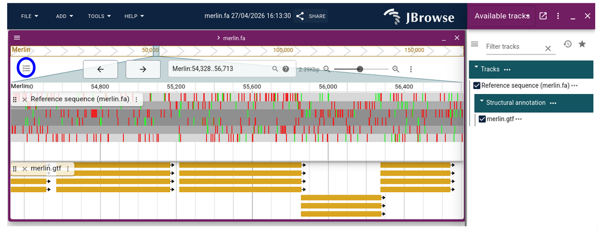
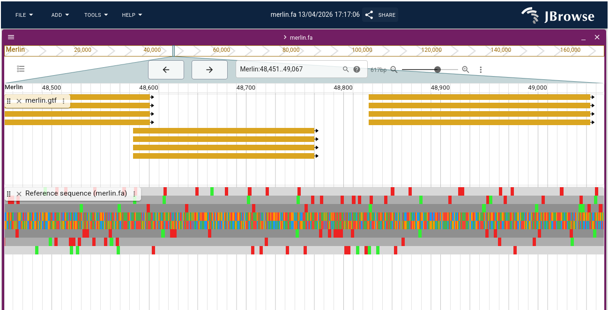
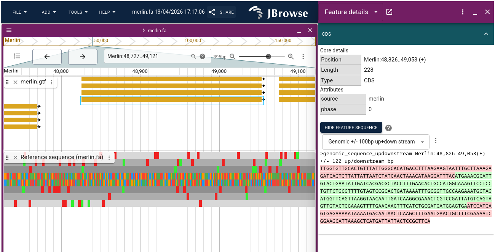
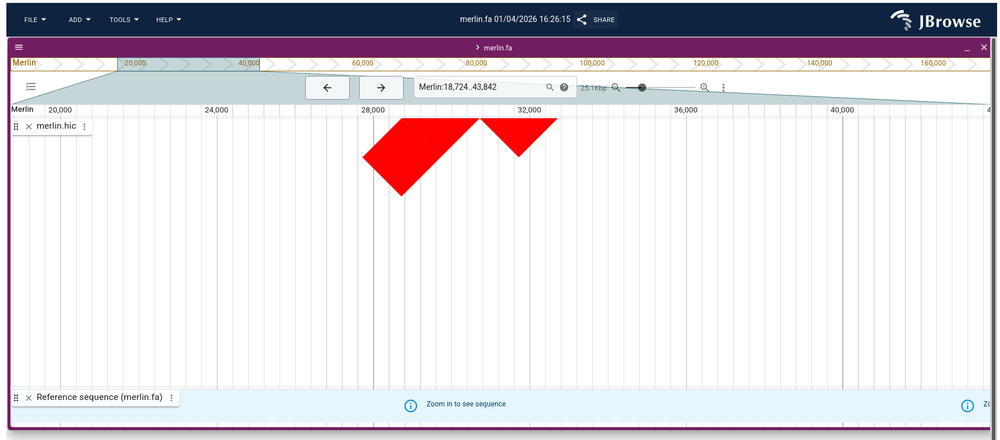

> [JBrowse2](https://pmc.ncbi.nlm.nih.gov/articles/PMC10108523/) is a fast, embeddable genome browser built completely with JavaScript
> and HTML5, with optional run-once data formatting tools written in Perl.
>
{: .quote cite="https://jbrowse.org/jb2/"}

JBrowse is an open-source genomic browser developed to view and explore genomoc data interactively. The first version, released in 2009, gained popularity due to its simplicity and its ability to display data in various formats: GFF3/GTF for annotations, BAM for RNA-seq alignements, BigWig for coverage, and VCF for variants.

With JBrowse2, released in 2020, the possibilities have been significantly expanded. This new version now allows for visualization of Hi-C data, offering a 3D representation of chromosomal interactions, a major asset forstudying genome structure.

JBrowse2 also introduces circular view, ideal for analyzing bacterial genomes or plasmids, as well as dotplots, which facilitate the comparison of syntenic regions across species. These new features enable a more in-depth and visual analysis of relationship between genomes.

Another key advantage is support for the CRAM format, a more compact alternative to BAM. This format reduces storage space while retaining the same functionality, which is particularly useful for large datasets.

For more information on JBrowse2, please visit this [website](https://jbrowse.org/jb2/).

In this tutorial, we will use JBrowse2, which is available on Galaxy.


> <agenda-title></agenda-title>
>
> In this tutorial, we will deal with:
>
> 1. TOC
> {:toc}
>
{: .agenda}

# Data Upload

> <hands-on-title>Getting the data</hands-on-title>
>
> 1. Create and name a new history for this tutorial.
>
>    
>
> 2. Import the datasets we will visualize:
>
>    ```
>    https://zenodo.org/records/19554505/files/data.bw
>    https://zenodo.org/records/19554505/files/merlin-sample.cram
>    https://zenodo.org/records/19554505/files/merlin.fa
>    https://zenodo.org/records/19554505/files/merlin.gtf
>    https://zenodo.org/records/19554505/files/merlin.hic
>    https://zenodo.org/records/19554505/files/test.vcf
>    ```
>
>    
>
{: .hands_on}

The data for this tutorial is a dataset from *Citrobacter phage Merlin*.

# Simple Gene Tracks

If you have used JBrowse1 before, using JBrowse2 on Galaxy is very similar. If this is your first time, don't worry, it's easy to use. We'll start by adding the structural annotation as a track in JBrowse2.

If you’re not familiar with structural annotation, we recommend reading the [general introduction to annotation](#1) and following the tutorials on annotating genomes (e.g. [Bacterial Genome Annotation](), or [Genome annotation with Helixer]()).

> <hands-on-title>Build the JBrowse2</hands-on-title>
>
> 1.  with the following parameters:
>    - *"Reference genome to display"*: `Use a genome from history`
>        -  *"Select the reference genome"*: `merlin.fa`
>    - Click on *"Insert Track Category"*:
>        -  *"Track Category Label"*: call it `Structural annotation`
>            - Click on *"Insert Track"*:
>                    - *"Track Type"*: `GFF/GFF3/BED Features`
>                        -  *"GFF/GFF3/BED Track Data"*: `merlin.gtf`
> 2. Execute
>
> 3. View the output
>
> 4. Turn on both tracks of data.
>
>    > <tip-title>Slect or remove tracks</tip-title>
>    >
>    > * To view the tracks, you need to select them.
>    > * To do this, click on **Open track selector** in the top-left corner, as shown in blue in the screenshot.
>    > * A list of all your tracks will appear on the right. You can select or deselect tracks to view.
>    > 
>    >
>    {: .tip}
>
>
> 5. Navigate along the genome. Feel free to zoom in on specific areas.
>
>    > <tip-title> Navigating in Jbrowse </tip-title>
>    > - To **navigate along the genome**, use your mouse by left-clicking and dragging. Arrows for moving are also available.
>    > - To **zoom in** on an area, you have several options. The first is to use the magnifying glass icon. The second option is to select your zoom level using your mouse.
>    > - If an area interests you, you can highlight it. Select the area in question, right-click, and select **“Bookmark region”**. You can change the color if you want to distinguish between different areas.
>    {: .tip}
>
> 6. By clicking on a gene, you will be able to get information about it, such as the type (CDS, exon, gene), its length and its position.
>
>    
>    
>
{: .hands_on}


If you are not familiar with JBrowse2, here are a few important points:
- To **navigate along the genome**, use your mouse by left-clicking and dragging. Arrows for moving are also available.
- To **zoom in** on an area, you have several options. The first is to use the magnifying glass icon. The second option is to select your zoom level using your mouse.
- If an area interests you, you can highlight it. Select the area in question, right-click, and select **“Bookmark region”**. You can change the color if you want to distinguish between different areas.

# Complex Gene Tracks

As mentioned in the introduction, JBrowse2 supports a wide range of input formats for tracks. We previously launched JBrowse2 with a single track, so let’s launch it with multiple tracks.

> <hands-on-title>Build a JBrowse2 with multiple tracks</hands-on-title>
>
> 1.  with the following parameters:
>    - *"Reference genome to display"*: `Use a genome from history`
>        -  *"Select the reference genome"*: `merlin.fa`
>    - Click on *"Insert Track Category"*:
>        -  *"Track Category Label"*: call it `Structural annotation`
>            - Click on *"Insert Track"*:
>                    - *"Track Type"*: `GFF/GFF3/BED Features`
>                        -  *"GFF/GFF3/BED Track Data"*: `merlin.gtf`
>    - Click on *"Insert Track Category"*:
>        -  *"Track Category Label"*: call it `Coverage`
>            - Click on *"Insert Track"*:
>                 - *"Track Type"*: `BigWig`
>                    -  *"BigWig Track Data"*: `data.bw`
>    - Click on *"Insert Track Category"*:
>        -  *"Track Category Label"*: call it `Alignement RNA-seq`
>            - Click on *"Insert Track"*:
>                 - *"Track Type"*: `CRAM`
>                    -  *"CRAM Track Data"*: `merlin-sample.cram`
>    - Click on *"Insert Track Category"*:
>        -  *"Track Category Label"*: call it `VCF SNPs`
>            - Click on *"Insert Track"*:
>                 - *"Track Type"*: `VCF SNPs`
>                    -  *"CRAM Track Data"*: `test.vcf`
>
> 2. Execute
> 3. View the output
>
>    .")
>
{: .hands_on}

# Hi-C Data Visualization

The .hic file is a standard format used to store Hi-C interaction matrices. These matrices represent physical contacts between chromosomal regions within a genome, thereby revealing its 3D spatial organization. Unlike linear data (such as GFF annotations or BAM alignments), Hi-C provides insight into how regions of the genome are organized and physically interact in space, for example, to form loops or structural domains.


> <hands-on-title>Build the JBrowse2 with Hi-C data</hands-on-title>
>
> 1.  with the following parameters:
>    - *"Reference genome to display"*: `Use a genome from history`
>        -  *"Select the reference genome"*: `merlin.fa`
>    - Click on *"Insert Track Category"*:
>        -  *"Track Category Label"*: call it `Hi-C`
>            - Click on *"Insert Track"*:
>                    - *"Track Type"*: `HiC`
>                        -  *"Hi-C Track Data"*: `merlin.hic`
> 2. Execute
>
> 3. View the contents of the file
>
>    
>
{: .hands_on}

In this image, we can see the chromosomal interactions in the 18,724–43,842 bp region of the *Citrobacter phage Merlin* genome.

How should we interpret our results?

A heatmap contains several patterns:
- The diagonal line shows local interactions between neighboring regions on the linear genome.
- The red blocks indicate long-range interactions between distant regions on the linear sequence. These blocks are often symmetrical and form an “X” or “checkerboard” pattern. This may correspond to:
  - DNA loops formed during replication or packaging of the viral genome.
  - Interactions between regulatory elements (e.g., promoters) that can influence gene transcription.
- Arcs connect regions in physical interaction, which can help us understand how the viral genome is organized within the capsid.


To explore other examples of Hi-C data (such as eukaryotic genomes or more complex matrices), we invite you to check out the [official JBrowse 2 demo](https://jbrowse.org/code/jb2/latest/?config=test_data%2Fconfig_demo.json&session=local-FcsRCX4o_A).

# Conclusion

This does not exhaustively cover JBrowse2, and the tool is more extensible than can be easily documented, but hopefully these examples are illustrative and can give you some ideas about your next steps. If you'd like to see more examples of visualizations, you can find them on the [JBrowse2 website](https://jbrowse.org/jb2/demos/).
